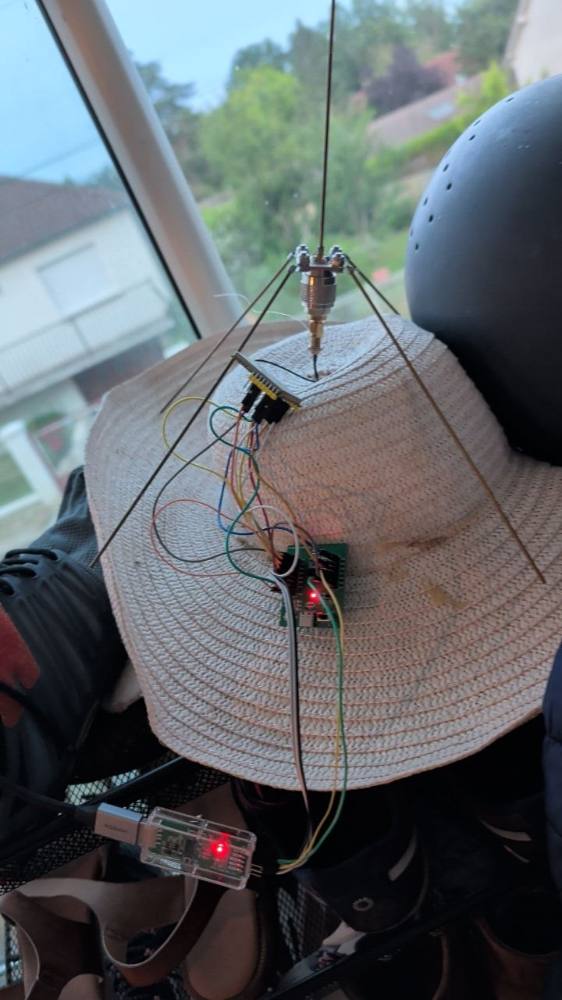
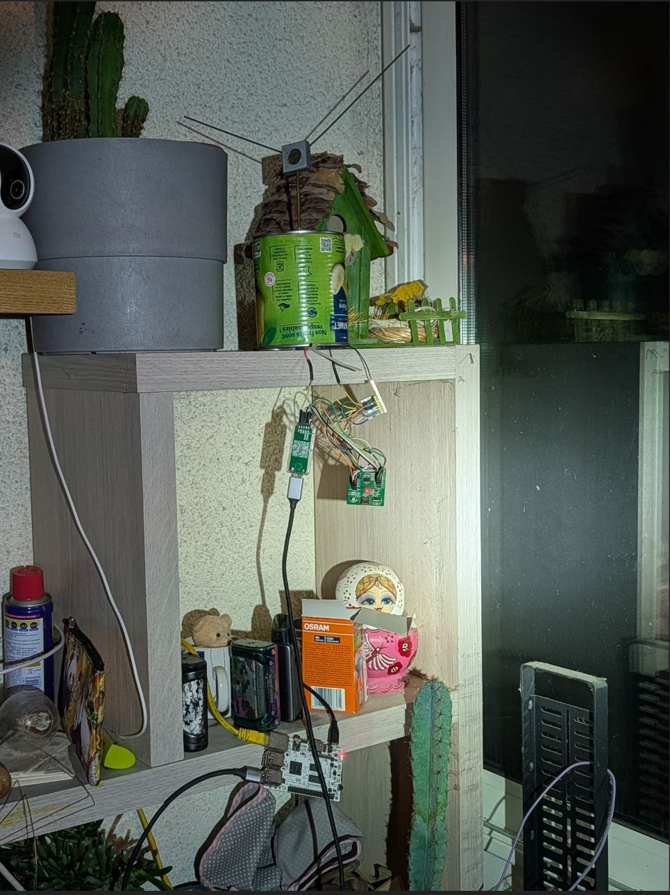

# at-os3

`at-os3` is a small event-driven AT modem firmware for CH32V003 boards driving
an SX1278-compatible LoRa radio.

The firmware exposes a UART AT command interface and keeps the radio control
path deterministic:

```text
interrupt -> event queue -> event loop -> FSM / handler
```

The current target is a CH32V003 wired to an SX1278 or Ebyte E32-style LoRa
module. It is used as a raw LoRa modem by a Linux host. 

## Prototype Hardware

Early CH32V003 + SX1278/Ebyte-module prototype wired to a quarter-wave ground
plane antenna:



Development setup used with a Linux host and window-mounted antenna:



## Use Case: PTGS

`at-os3` was built to act as the small RF modem in a split TinyGS-style ground
station.

The companion project is PTGS:

```text
https://github.com/netmonk/ptgs
```

PTGS runs on a Linux host. It connects to the TinyGS MQTT backend, receives
backend modem commands, computes Doppler correction from TLE/TLX data, and
publishes received packets back as TinyGS telemetry.

`at-os3` stays next to the radio hardware. It only handles the deterministic
modem side: UART AT commands, SX1278 register programming, LoRa RX/TX,
interrupt handling, and packet reports with RSSI/SNR/frequency error.

This split keeps TLS, MQTT credentials, logs, and satellite scheduling on
Linux, while the CH32V003 remains a small replaceable LoRa front end close to
the antenna.

## What OS3 Means Here

`at-os3` is built on the OS3 kernel model used in this repository: a small
deterministic event kernel, not a general-purpose RTOS.

OS3 is organized around a few rules:

- all progress starts from explicit events;
- interrupts only acknowledge hardware, capture minimal data, and enqueue one
  event;
- protocol behavior runs later from the event loop;
- stateful behavior lives in table-driven FSMs;
- hardware access stays in drivers;
- services and handlers must not create hidden background progression.

For the LoRa modem path, the intended execution shape is:

```text
UART byte / radio IRQ
-> event_enqueue
-> event_loop
-> AT parser / LoRa FSM
-> bounded action
```

This is why the code is split into:

| Directory | Role |
|---|---|
| `core/` | event queue, event loop, FSM engine, timer, console service |
| `drivers/ch32v003/` | CH32V003 peripherals, UART, SPI, EXTI, SX1278 register access |
| `subfsm/` | table-driven domain FSMs, including the AT parser and LoRa FSM |
| `handlers/` | stateless event reactions |

The project constitution is in [CONSTITUTION.md](CONSTITUTION.md).

## Features

- UART AT command interface at 115200 8N1
- Raw LoRa RX/TX
- SX1278 register-level control
- Frequency, SF, bandwidth, coding rate, preamble, sync word, IQ inversion,
  CRC, LDRO, and implicit payload length configuration
- RX packet reports with RSSI, SNR, and frequency error estimate
- Event-driven interrupt handling
- Table-driven LoRa FSM

See [doc/AT_COMMANDS.md](doc/AT_COMMANDS.md) for the command reference.

## Hardware Target

Current firmware target:

- MCU: official CH32V003 development board
- Radio: SX1278-compatible LoRa front end
- Tested module family: Ebyte E32-style SX1278 modules
- Host link: CH32V003 USART1 connected to a USB-UART bridge or host UART
- Default UART: 115200 baud, 8 data bits, no parity, 1 stop bit

Example CH32V003 development board:

```text
https://fr.aliexpress.com/item/1005005269690018.html
```

Example Ebyte LoRa module:

```text
https://fr.aliexpress.com/item/1005004447877680.html
```

Equivalent CH32V003 boards can be used if the pins required by
[doc/PINOUT.md](doc/PINOUT.md) are available.

Important pins:

- Radio SPI/control: `PC0..PC7`
- Host UART: `PD5` TX, `PD6` RX
- LEDs: `PD4` heartbeat, `PD2` radio activity

See [doc/PINOUT.md](doc/PINOUT.md) for the complete pinout.

## Build Requirements

The build script expects a RISC-V embedded toolchain in `PATH`:

- `riscv32-unknown-elf-as`
- `riscv32-unknown-elf-ld`
- `riscv32-unknown-elf-objcopy`
- `riscv32-unknown-elf-size`
- `riscv32-unknown-elf-nm`

The firmware is assembled as RV32EC with the `zicsr` extension and the
`ilp32e` ABI.

## Build

From the repository root:

```bash
RADIO=SX1278 ./run.sh
```

This builds the SX1278 radio variant with the HSE clock variant. The HSE build
expects a board with a working 24 MHz external crystal.

Build output is written to:

```text
build/ch32v003/kernel.elf
build/ch32v003/kernel-sx1278-hse.bin
```

To build the HSI clock variant, use:

```bash
CLOCK=HSI RADIO=SX1278 ./run.sh
```

The HSI build uses the CH32V003 internal 24 MHz RC oscillator.

Its binary output is:

```text
build/ch32v003/kernel-sx1278-hsi.bin
```

Valid clock selections are `CLOCK=HSE` and `CLOCK=HSI`. The radio selection is
mandatory. Valid radio selections are `RADIO=SX1278` and `RADIO=SX1262`.
The SX1262/E22 backend is an initial port: it links, but high-power
E22-900M30S PA behavior and radio-side packet options still need hardware
validation.

The script cleans and reuses `build/ch32v003` for each build. Object files and
`kernel.elf` keep the same names; only the generated binary image is named by
radio and clock variant. The script also prints section sizes and
`.kernel_init` entries.

## Flash

Flash the generated binary with your CH32V003 programming tool. For a local
`minichlink` setup, the command shape is:

```bash
minichlink -w build/ch32v003/kernel-sx1278-hse.bin flash
```

Use `build/ch32v003/kernel-sx1278-hsi.bin` instead if you built with
`CLOCK=HSI RADIO=SX1278`.

`minichlink` is part of the `ch32fun` project:

```text
https://github.com/cnlohr/ch32fun
```

Use the exact command required by your installed programmer and target board.

## Basic Smoke Test

After flashing, connect the host UART at 115200 8N1 and send:

```text
AT
```

Expected response:

```text
+OK
```

Read the firmware version:

```text
AT+VER?
```

Expected response:

```text
+VER=at-os3-0.1.0
+OK
```

## Host Test Script

The repository includes [tools/test_radio.py](tools/test_radio.py), a small
host-side serial test script for RX/TX checks. It requires Python 3 and
`pyserial`:

```bash
python3 -m pip install pyserial
```

Probe the modem and radio SPI link:

```bash
python3 tools/test_radio.py /dev/ttyACM0 --probe
```

Listen on a raw LoRa profile:

```bash
python3 tools/test_radio.py /dev/ttyACM0 \
  --freq 436995000 --sf 8 --bw 62.5 --cr 7 --sw 0x12 \
  --rx-seconds 120
```

Transmit text on the same profile:

```bash
python3 tools/test_radio.py /dev/ttyACM0 \
  --freq 436995000 --sf 8 --bw 62.5 --cr 7 --sw 0x12 \
  --send-text ping
```

Transmit a hexadecimal payload:

```bash
python3 tools/test_radio.py /dev/ttyACM0 \
  --freq 436995000 --sf 8 --bw 62.5 --cr 7 --sw 0x12 \
  --send 70696E67
```

For interoperability testing, [tools/test_loopback.py](tools/test_loopback.py)
runs bidirectional profile checks between two serial modems. The `sx1262`
branch has been validated with an ESP32 LoRa node on one side and a CH32V003
`RADIO=SX1262` firmware on the other side, with the current loopback suite
passing `56/56` profile-direction checks.

## Typical RX Setup

Example raw LoRa RX profile:

```text
AT+MODE=1
AT+BAND=436995000
AT+PARAMETER=8,6,3,8
AT+PKT=1,0,0
AT+SYNCWORD=18
AT+IQI=0
AT+MODE=0
```

Received packets are emitted as:

```text
+RCV=<addr>,<len>,<hex_payload>,<rssi_dbm>,<snr_db>,<freq_err_hz>
```

PHY CRC failures are emitted as:

```text
+ERR=1
```

## Repository Layout

```text
core/              hardware-agnostic event/FSM/kernel services
drivers/ch32v003/ CH32V003 hardware drivers and SX1278 driver
subfsm/           table-driven domain FSMs
handlers/         stateless event handlers
link/             linker scripts
doc/              AT command and hardware documentation
run.sh            build script
```

## License

Copyright (C) 2026 Dominique CARREL (netmonk) <netmonk@netmonk.org>.

Firmware source code, build scripts, and hardware documentation are licensed
under GPL-3.0-or-later.

The OS3 constitution text in [CONSTITUTION.md](CONSTITUTION.md) is licensed
separately under CC BY-ND 4.0, because the constitution is the project's
canonical design contract and must remain attributable and non-mutated.

See [LICENSE](LICENSE) and [LICENSE-CONSTITUTION.md](LICENSE-CONSTITUTION.md).

## Notes

- The firmware is a raw LoRa modem, not a network stack.
- `AT+ADDRESS` and `AT+NETWORKID` are stored for host-side compatibility,
  but raw LoRa RX/TX payloads are not framed with a network header.
- Ebyte module RF performance outside its specified operating band depends on
  the module RF front end, not only on the SX1278 synthesizer range.
